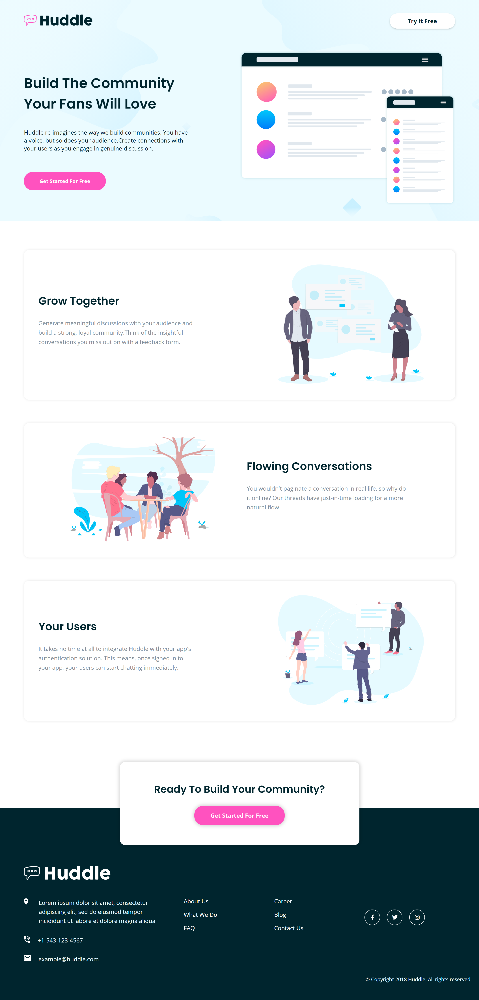

# Frontend Mentor - Huddle landing page with alternating feature blocks solution

## Welcome! 👋

Thanks for checking out this front-end coding challenge.

## Table of contents

- [Overview](#overview)
  - [The challenge](#the-challenge)
  - [Screenshot](#screenshot)
  - [Links](#links)
- [My process](#my-process)
  - [Built with](#built-with)
- [Author](#author)

## Overview

### The challenge

Users should be able to:

- View the optimal layout for the site depending on their device's screen size
- See hover states for all interactive elements on the page

### Screenshot

## My process

### Built with

- Semantic HTML5 markup
- CSS custom properties
- Flexbox
- Mobile-first workflow

## Author

- Linkedin - [@raheemalzeeshan](https://www.linkedin.com/in/raheemalzeeshan/)
- Frontend Mentor - [@raheemalzeeshan](https://www.frontendmentor.io/profile/raheemalzeeshan)
- Twitter - [@raheemalzeeshan](https://www.twitter.com/raheemalzeeshan)

**Thank You!** 🚀